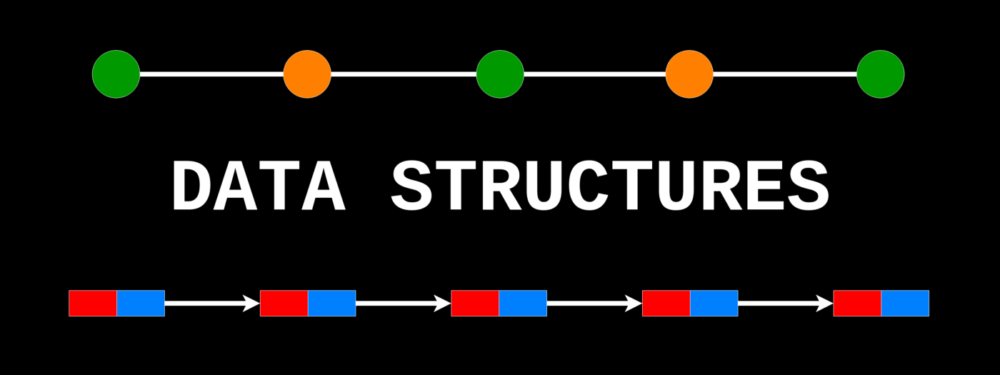

<h1>Data Strucuture</h1>

<h2 style="color:#FF7000;">Introduction</h2>

- This a data structure implementation that will help student to understand data structure with perfect comments in every code file

<h3 style="color:crimson;">What is data structure?</h3>

<h4>
Data Structure:
 is a specialized format for organizing, processing, retrieving and storing data. </h4>

<h3 align="center">Topics</h3>

###

<h4 align="left">1- Stack with array</h4>

###

<h4 align="left">2- Stack with linked list</h4>

###

<h4 align="left">3- balanced parenthesis problem using stack</h4>

###

<h4 align="left">4- Infix To Postfix using stack</h4>

###

<h4 align="left">5- Queue using circular array</h4>

###

<h4 align="left">6- Queue using linked list</h4>

###

<h4 align="left">7- Array based list</h4>

###

<h4 align="left">8- Array-based list with linear search and set concept</h4>

###

<h4 align="left">9- Linked List full implementation with search.</h4>

###

<h4 align="left">10- Doubly Linked List.</h4>

###

<h4 align="left">11- Binary Search.</h4>

###

<h4 align="left">12- Binary Search Tree.</h4>

###

<h4 align="left">13- Selection Sort.</h4>

###

<h4 align="left">14- Bubble Sort.</h4>

###

<h4 align="left">15- Insertion Sort.</h4>

###

<h4 align="left">16- Merge Sort.</h4>

###

<h4 align="left">17- Quick Sort.</h4>

###

<h4 align="left">18- Heap Sort.</h4>

###

<h4 align="left">19- Linear Search.</h4>

###

<h4 align="left">20- Binary Search.</h4>

###
